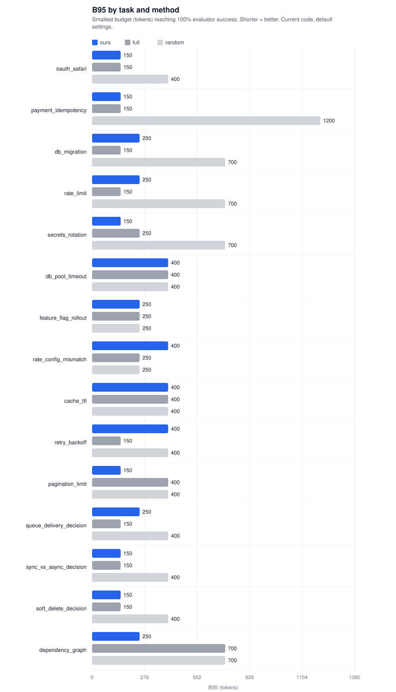
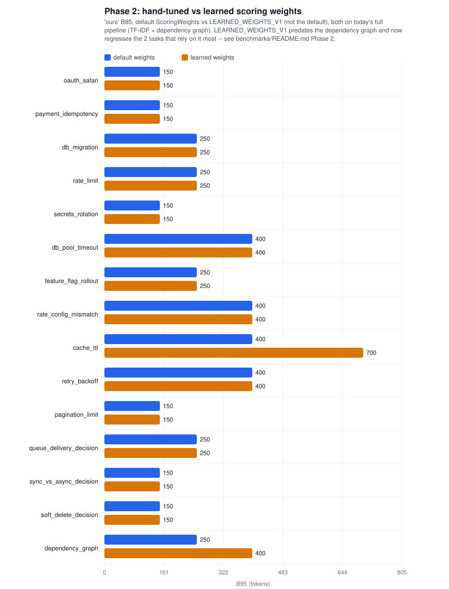
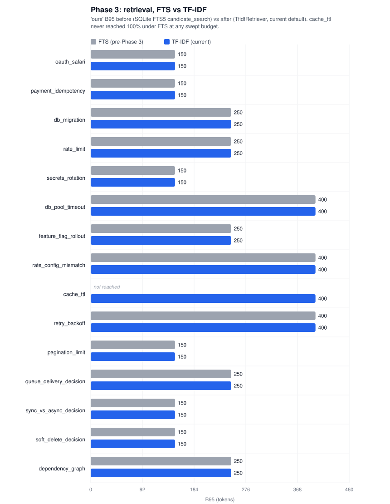
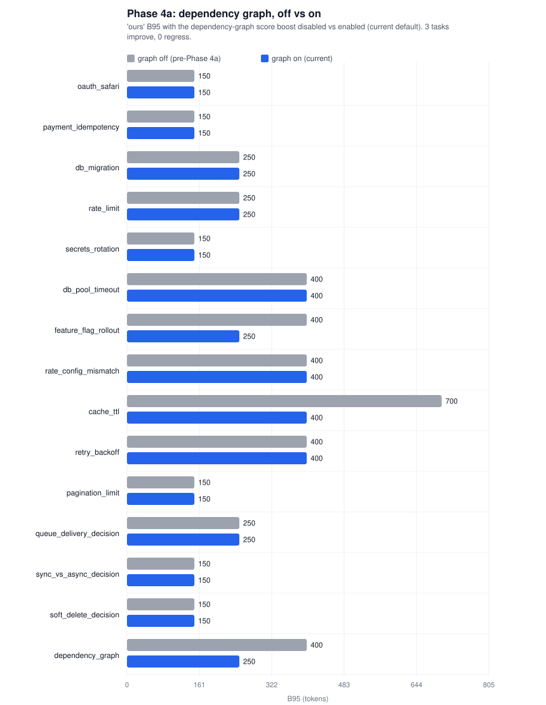
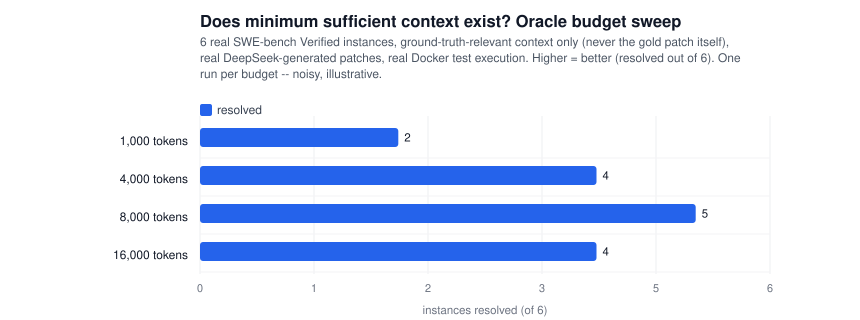
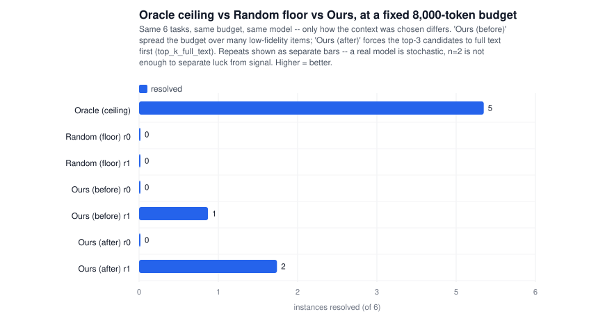

# Starter benchmark

A first, runnable slice of README.md's "Recommended next research
iterations" (items 1-3): a small benchmark harness that compares the
scored/allocated compiler (`ours`) against two naive baselines under a
budget sweep, plus a per-task Oracle reference point.

## Run it

```bash
python benchmarks/run.py
```

Writes `benchmarks/results/results.json` (raw sweep points) and
`benchmarks/REPORT.md` (human-readable table), and prints the report to
stdout.

Filter or override the sweep without editing the script:

```bash
python benchmarks/run.py --tasks oauth_safari,cache_ttl --budgets 150,700,2000
```

Regenerate the charts embedded throughout this file from whatever
`results*.json` files are currently on disk:

```bash
python benchmarks/plot_results.py
```

## What is being measured

Each task in `tasks.py` points at a small synthetic repo under `repos/`
containing a handful of distractor files plus exactly one file carrying the
fact the task cannot be solved correctly without. Tasks come in four
shapes, on purpose — an earlier version of this harness was 100%
"constraint doc," which structurally favored `ours` (constraints get a
forced minimum render level) and never exercised the scorer's actual
relevance ranking:

- **constraint** (5 tasks) — a policy/constraint doc must survive into the
  working set, e.g. "never retry a charge without a confirmed idempotency
  key." Gets the compiler's forced-minimum-level safety net.
- **config-lookup** (3 tasks) — the fact is a specific value in a config
  file (`.env`/`.yaml`), no policy doc involved. No safety net.
- **code-behavior** (3 tasks) — the fact is in a function's actual
  default/logic (a cache TTL, a retry count), not a doc. No safety net.
- **decision-record** (3 tasks) — a doc explaining "we chose X over Y, for
  reason Z"; the correct action is to respect the decision. No safety net.
- **dependency-graph** (1 task) — the fact lives in a file the task wording
  doesn't lexically mention at all; it's only reachable by knowing a file
  the task *does* mention imports it. Purpose-built to stress
  `context_compiler.graph`, not relevance ranking. See Phase 4 below.

15 tasks total. The evaluator is a deterministic, case/whitespace-
insensitive keyword-conjunction check against the compiled context text:
does the working set contain the fact, at any budget.

Methods compared:

- `ours` — `ContextCompiler` (scored, multi-resolution, budget-allocated).
- `full` — dump every file at full fidelity in path-sorted order, stop at
  the first file that would overflow the budget. Models "just paste the
  repo".
- `random` — shuffle files, greedily keep whatever fits (20 repeats per
  budget to smooth the estimate). Models "grab an arbitrary subset".
- `oracle_tokens` — the smallest single-representation cost of the one
  file that alone satisfies the evaluator. Not a method under test; a
  lower bound on how cheap a perfectly-informed selector could be.



Generated by `python benchmarks/plot_results.py` from the committed
`results*.json` files (no charting dependency — plain SVG; see the
script). Re-run it after re-running the benchmark if you've changed
something and want the charts to reflect it.

## A second evaluator: LLM judge (opt-in, costs real money)

The default keyword evaluator answers "is the fact present in the working
set," never "did an LLM decide the context was sufficient." A first step
past pure keyword matching:

```bash
pip install -e '.[llm_judge]'
export ANTHROPIC_API_KEY=...
python benchmarks/run.py --evaluator llm_judge --tasks oauth_safari --budgets 700 --yes
```

`benchmarks/llm_judge_eval.py` sends the compiled context and task to
`claude-haiku-4-5` and asks it to judge sufficiency — a real model call,
not a keyword check. It is **not** part of the default sweep (that stays
free and instant) and refuses to run without `--yes`, since cost scales
with tasks × budgets × methods. It is still a judge over text, not a real
coding agent that produces and tests a patch — see "Honest limitations"
below.

## Phase 2: learned scoring weights (opt-in, not the default)

```bash
python benchmarks/learn_weights.py
```

Runs `ExperimentRunner.deletion_test` against every task's compiled
working set (budget 3000, generous enough that nearly every candidate is
selected), pairing each selected item's raw `ScoreBreakdown` components
(relevance, importance, risk, recency, dependency, kind_prior, pin_bonus)
with a label: did removing this item break the task. That is exactly the
"direct but expensive" labeling strategy DESIGN.md describes for a future
Context Sufficiency / Marginal Value Estimator. A pure-Python (no
numpy/sklearn — confirmed unavailable in this environment) L2-regularized
logistic regression fits those labels, and the result is written to
`benchmarks/results/learned_weights.json`.

**Results, honestly:** 60 examples from 14 tasks (13 "essential" / 47
not). Leave-one-task-out CV: classification accuracy 0.78 is barely above
the 0.78 majority-class baseline (always guessing "not essential") — not
informative given the class imbalance. The metric that actually matches
how the compiler uses these weights — to *rank* candidates, not classify
them — is whether the top-ranked item in a held-out task is the essential
one: **69%, against a 25% chance baseline**. That's a real signal on a
small sample, not proof. Two features (`recency`, `pin_bonus`) are
near-constant across every example in this benchmark (every item has the
same age; nothing is manually pinned), so their fitted coefficients are
floor-value artifacts, not learned signal — `coefficients_to_weights`
detects this and keeps those two at their hand-tuned default instead of
using the artifact.

The fitted result ships as `LEARNED_WEIGHTS_V1` in
`context_compiler.scoring` — **not the default**, opt in explicitly:

```python
from context_compiler import ContextCompiler, ContextStore
from context_compiler.scoring import LEARNED_WEIGHTS_V1

compiler = ContextCompiler(store, weights=LEARNED_WEIGHTS_V1)
```

or from this benchmark's own sweep, to compare directly against the
default:

```bash
python benchmarks/run.py --weights learned
```

Doing that head-to-head comparison across all 14 tasks (at the time this
was run, against the original FTS retriever that was still the default —
see Phase 3 below): **B95 improved on 3/14 tasks (`payment_idempotency`,
`feature_flag_rollout`, `retry_backoff`), regressed on none, unchanged on
the rest** (`cache_ttl` still failed at every budget either way at the
time — reweighting scores among candidates that already passed FTS
retrieval can't recover an item FTS never let into the pool in the first
place; Phase 3 below fixes that at the retrieval layer instead). A small,
real, honestly-bounded improvement — not remotely enough evidence to make
this the shipped default on 14 self-authored synthetic tasks scored by a
keyword-check proxy, which is exactly why it isn't.

**Update, after Phase 3 and 4a landed:** re-running this same comparison
against *today's* full pipeline (TF-IDF retrieval + the dependency graph)
tells a different, more cautionary story:



`LEARNED_WEIGHTS_V1` now **regresses 2 tasks** (`cache_ttl` 400 -> 700,
`dependency_graph` 250 -> 400) and helps none, on the current 15-task set.
Cause: `LEARNED_WEIGHTS_V1.dependency` is `0.010`, roughly 8x smaller than
the hand-tuned default's `0.08` — a reasonable fit at the time, since
Phase 2's benchmark only had the old term-overlap dependency signal to
learn from, which genuinely wasn't very predictive. But Phase 4a's graph
feature (below) reuses that *same* weight to apply its much stronger
"confirmed import edge" ceiling score, and the stale, deliberately-low
weight now suppresses a signal it was never fit against. This is a
concrete instance of a general risk with any fitted preset: **it goes
stale when the feature set it was fit on changes**, silently, unless
someone re-runs `learn_weights.py` and checks. `LEARNED_WEIGHTS_V1` was
already not the default before this was noticed; it still isn't, and this
is the reason it should probably be re-fit (or retired) rather than
trusted as-is going forward.

## Phase 3: pluggable retrieval, TF-IDF as the new default

Phase 1 and 2 both ran into the same wall on `cache_ttl`: no matter how
good the scorer's weights are, they only ever run on whatever
`ContextStore.candidate_search` (SQLite FTS5, `OR`-matched, ranked by
BM25) decided was a candidate in the first place. FTS5's `MATCH` clause
is a hard filter — an item with zero exact-token overlap against the
query gets zero rows back, full stop, regardless of how relevant it
actually is by every other signal (importance, kind, dependency).
`context_compiler/retrieval.py` replaces that with a pluggable
`Retriever` protocol:

- **`TfidfRetriever`** (new default) — classical TF-IDF cosine similarity,
  computed fresh per query, no persisted index, still zero required
  dependencies. Critically, it **scores every candidate it's handed,
  including zero-overlap ones**, and returns the top-`limit` by score —
  it degrades to "everything, unranked" rather than "silently missing,"
  so items that don't share exact tokens with the query still reach
  `ContextCompiler`'s real scorer (importance/risk/kind/dependency),
  which the old FTS filter never gave them the chance to do.
- **`FTSRetriever`** — thin wrapper around the original
  `candidate_search`, kept for direct comparison
  (`python benchmarks/run.py --retriever fts`).
- The "never silently drop a pinned/constraint/high-risk item" safety net
  moved out of `candidate_search` into a small `augment_with_critical_items`
  helper the compiler applies uniformly, regardless of which retriever is
  plugged in — it was retrieval-strategy policy, not a property of FTS
  specifically.

**Result, confirmed by re-running the full sweep:** switching the default
from FTS to TF-IDF fixed `cache_ttl` outright — B95 went from unreachable
at any swept budget (up to 3000 tokens) to 700, with **0 other tasks
regressed and 13 unchanged**. This is exactly the roadmap's own limitation
#1 being closed, not just narrowed: reproduce the before/after yourself
with `python benchmarks/run.py --retriever fts --tasks cache_ttl` vs the
default `python benchmarks/run.py --tasks cache_ttl`.



TF-IDF is still lexical — it has no stemming or synonym match either, so
a query and a document sharing zero *tokens* still score 0.0 between
them. What changed is that a 0.0 score no longer means "never considered"
— it means "ranked last, but still eligible if nothing else claims the
budget." Real embedding-based retrieval (README limitation #1's other
half) is still open; it's a drop-in `Retriever` implementation away from
being swapped in without touching `ContextCompiler`.

## Honest limitations of this slice

This is explicitly a **starter** harness, not the benchmark the README
roadmap describes:

1. **15 tasks, not 30-100.** Larger and more varied than the first version
   (5 tasks, one shape), but still too small to draw statistically
   confident conclusions; treat results as illustrative, not definitive.
2. **Two evaluators, neither is a real agent/test harness.** The default
   keyword check answers "is the fact present." `llm_judge` is a step
   closer — an actual model judgment — but it's still a judge over
   *compiled text*, not a coding agent that produces a patch and runs the
   task's real tests. Wire in `JsonCommandEvaluator` from
   `context_compiler.experiments` with a real coding-agent harness to get
   that signal.
3. **Synthetic, hand-written repos.** They are sized and worded by the
   same person who tuned the scorer, which risks unconsciously favoring
   `ours`. A real benchmark should pull tasks/repos the compiler's
   author did not write (e.g. SWE-bench-style tasks).
4. **No `Embedding RAG` baseline yet.** *Partially addressed:* the
   original `Lexical/FTS`-only retriever is now a real, runnable
   comparison (`--retriever fts`, see Phase 3), since it needs no new
   dependency. Embedding retrieval still does — it's still open (see
   top-level README limitation #1).

## Real findings this harness has already surfaced

**1. A forced-minimum-level gap (fixed).** The first run showed `ours`
losing to the naive `full` baseline at the tightest budget (150 tokens) on
two constraint tasks (`db_migration`, `rate_limit`). Root causes, both
real:

- The compiler's forced-minimum level for *ingested* (non-manually-pinned)
  constraint items defaulted to `L1`, which only ever renders a fixed
  lead line — for a markdown policy doc structured as `# Title` followed
  by the actual invariant in the next paragraph, `L1` surfaced the title,
  not the invariant. Fixed by moving the default to `L2` (task-aware
  extractive summary) in `src/context_compiler/compiler.py`
  (`CompilerConfig.constraint_min_level`).
- Independent of that fix, `ours` carries a larger fixed header
  ("Use the following task-specific working set...") than the naive
  baselines' bare `TASK:` line, which costs real tokens at extremely
  tight budgets. This is a genuine trade-off, not a bug — left as-is and
  documented rather than tuned away.

**2. Lexical retrieval can drop a relevant item entirely, at any budget
(fixed in Phase 3).** On the `cache_ttl` task (task wording: "cached
prices"; the fact lives in `cache.py`, whose content never uses the word
"cached"), `ours` never reached 100% success even at the largest swept
budget (3000 tokens), while `full` and `random` succeeded from budget 400
onward. Cause: `ContextCompiler.compile` called
`ContextStore.candidate_search`, which ran a SQLite FTS5 query against the
task's literal terms — no stemming, no synonym match. If a relevant item
scored zero FTS hits and wasn't pinned/constraint/high-risk, it never
entered the candidate pool the allocator saw, so **no budget, however
large, could recover it**. This was a direct, reproducible demonstration
of the top-level README's limitation #1 ("Candidate retrieval is
lexical/FTS, not embedding-based") — it's what motivated prioritizing
Phase 3 (pluggable retrieval, TF-IDF default) over the other queued
phases, and that phase closes this specific gap: see "Phase 3" above for
the fix and the confirmed before/after (`cache_ttl` B95 went from
unreachable to `700` in Phase 3, then to `400` in Phase 4 below). The
underlying limitation (lexical, not embedding-based, still no
stemming/synonyms) is narrowed, not eliminated.

## Phase 4a: a real dependency graph, and a determinism bug it surfaced

Two things shipped together here because the second was found while
verifying the first.

**The feature.** `ingest.py`'s dependency extraction only ever produced
opaque import strings (`"gateway_client"`, `".validators"`) -- text for
the scorer's term-overlap heuristic, never an actual graph. There was no
way to ask "what does this file import" as a resolved item id, and no
reverse direction ("what imports this file") at all.
`context_compiler/graph.py` resolves those strings against the same
store -- a Python relative import, a `./foo` JS import, an absolute
dotted path -- into real forward/reverse edges between `ContextItem`s,
best-effort and conservative (an ambiguous basename match is left
unresolved rather than guessed). `ContextCompiler` uses it to give a
confirmed graph neighbor of a top-scoring candidate a dependency-score
ceiling in the second scoring pass -- a real resolved import edge is a
stronger signal than the term-overlap proxy `activated_dependency_terms`
already used. Toggle for comparison: `python benchmarks/run.py --graph
off`.

A new task, `dependency_graph`, is purpose-built to isolate this: the
task wording lexically matches `handler.py` ("checkout", "endpoint") but
the actual constraint lives in `validators.py`, deliberately worded with
no shared vocabulary ("reimbursement," "surpass," "draining funds") --
`validators.py` is only reachable by knowing `handler.py` imports it.

**The bug this surfaced.** Verifying the graph feature's before/after
required running the same task+repo+budget repeatedly, which exposed
something the benchmark had been silently absorbing since Phase 1:
**`ContextCompiler.compile()` was not deterministic.** The identical
repository, re-ingested into a fresh store, could occasionally flip a
budget-boundary result between success and failure. Two compounding
causes, both in `context_compiler/store.py`, now fixed:

- `ContextStore.list()`'s `ORDER BY pinned DESC, updated_at DESC` had no
  tiebreak. Items ingested in the same batch commonly share the same
  `updated_at` down to the stored precision, and SQLite does not
  guarantee a stable row order for ties -- candidate ranking could vary
  across separate connections to separate database files for byte
  -identical content. Fixed by adding `source ASC, id ASC` as an explicit,
  reproducible-across-runs tiebreak (not `id` alone -- see below).
- Every rendered item embeds its id in a `[CTX:...]` header, so the id's
  own token count is part of every budget decision. Ids were a bare
  random hex string (`uuid.uuid4().hex[:16]`); `HeuristicTokenCounter`'s
  regex tokenizes a hex string starting with a letter as one token but
  one starting with a digit as two (a leading number plus a trailing
  identifier) -- so the *same* file, re-ingested, could cost a different
  number of tokens purely by chance (roughly 5/8 of raw hex ids start
  with a digit), occasionally shifting which side of a tight budget an
  item landed on. Fixed by generating ids as `f"c{uuid.uuid4().hex[:15]}"`
  -- always one token, deterministically.

Confirmed fixed: `benchmarks/run.py`'s full sweep now produces
byte-identical `results.json` across repeated runs (verified: `diff` on
back-to-back full-suite runs), and `tests/test_store.py` /
`tests/test_compiler.py` carry regression tests for both causes.

**This retroactively affects how to read every earlier B95 number in this
file.** Findings reported as large, multi-budget swings (`cache_ttl`
going from unreachable to succeeding at every budget from 400 up) are far
too big to be explained by a +-1-token boundary jitter and stand as
reported. A B95 that differs from a neighboring baseline by exactly one
budget step, on a task where the compiler was already close to a
threshold, is the shape of result this bug could produce -- Phase 2's
"3/14 tasks improved" comparison in particular included at least one such
case (`payment_idempotency`, B95 250 -> 150) that a clean re-run **after
this fix** shows as unchanged (150 both ways); the other two Phase 2
improvements still hold under a clean re-run. Re-running any comparison
in this file with the current code is the reliable way to check a
specific number, rather than trusting the frozen JSON snapshots as
permanently accurate.

**The dependency-graph feature itself, on a clean re-run after the fix:**
B95 improved on 3/15 tasks (`feature_flag_rollout` 400 -> 250, `cache_ttl`
700 -> 400, and the purpose-built `dependency_graph` 400 -> 250),
regressed on 0, unchanged on the rest.



(This is also the feature that Phase 2's `LEARNED_WEIGHTS_V1` preset now
undermines on exactly these two non-`dependency_graph` tasks — see the
update at the end of the Phase 2 section above.)

## 2026-08-18: two bugs a real SWE-bench Verified instance found

Every task in this file's benchmark is synthetic -- a short, hand-written
one-liner against a small repo we built. That's a structural blind spot:
some real-world failure modes literally cannot occur in a task string
designed to fit one sentence, or a repo designed to fit a handful of
files. As a spot check (not yet a wired-in, committed benchmark path --
see caveat below), we pulled 6 real instances from the official
`princeton-nlp/SWE-bench_Verified` dataset (300/500 test rows spot-
checked for schema/row-count/null integrity against the published specs
before trusting it), one per repo (`pallets/flask`, `psf/requests`,
`pytest-dev/pytest`, `pylint-dev/pylint`, `astropy/astropy`,
`django/django`), downloaded each real repo at the issue's `base_commit`,
ingested it, and checked whether `compile()` surfaced the files the
issue's gold patch actually touches ("oracle files") at budgets from
1000 to 16000 tokens.

5/6 instances hit the oracle file at every budget tested, on real,
messy, multi-thousand-file repositories (`django/django` ingested 3956
files in 15s with zero ingest errors). `pylint-dev/pylint-7080` hit 0/5 --
tracing why surfaced two real bugs, neither reachable by this repo's
own 15 short synthetic tasks:

1. **A verbose task can consume the whole budget on its own.** The
   `[CONTEXT-COMPILER]... TASK: <text>` header embeds the task string
   verbatim; unlike stored items, it never goes through L0-L4
   compression. Real GitHub issues often paste a CLI log or stack trace
   -- pylint-7080's `problem_statement` alone was 6510 tokens. At budget
   1000/2000/4000, the header alone exceeded the budget, so `compile()`
   selected **zero** context items at every one of those budgets, and the
   final defensive hard-cap truncated the raw task text itself rather
   than any real working set.
2. **The default candidate limit hard-truncated before scoring, with no
   relationship to the budget.** `pylint/lint/expand_modules.py` -- the
   file the gold patch actually touches -- ranked 181st by TF-IDF out of
   2971 ingested files (the issue's pasted lint-checker output shares far
   more vocabulary with other checker files than with the actual fix
   location). `compile()`'s default `max_candidates=120` truncated the
   ranked pool before any scoring ran, so this file was unreachable **at
   any budget**, including 16000 tokens -- confirmed by manually raising
   `max_candidates` past 181, which recovered it immediately.

**Fix, in `context_compiler/compiler.py`:**

- `CompilerConfig.max_header_fraction` (default `0.3`) caps the task
  header to that fraction of budget; if the raw task text would exceed
  it, `_bounded_task_header()` truncates the task text itself (via the
  same `TokenCounter.truncate()` already used for the final hard-cap, so
  the omission is marked with a visible `…`) and logs an audit entry.
  Most of the budget is now always available for real context,
  regardless of how verbose the task string is.
- The default candidate limit is no longer the flat `max_candidates`
  constant: `max(config.max_candidates, budget // config.
  candidate_tokens_estimate)`, capped at `max_pool_size`.
  `candidate_tokens_estimate` (default `40`) is the measured cost of an
  L0 (cheapest) rendering of a typical item -- an estimate of "how many
  of the cheapest possible items this budget could even afford," used as
  a floor on how deep retrieval should look. A caller-supplied
  `max_candidates` is still respected exactly as given. Small budgets
  (`budget // 40 < 120`, true of every budget in this repo's own 15-task
  sweep) are unaffected -- confirmed by re-running the full sweep before
  and after: all 15 B95 numbers are byte-identical.

Re-running the same 6 SWE-bench instances after the fix: pylint-7080
reaches the oracle file at budget 8000 and 16000 (candidate limit widens
past rank 181 there), still misses at 1000/2000/4000 -- a budget that
small genuinely cannot fit the file at its rank, which is the correct,
honest outcome, not a bug. The other 5 instances are unaffected (still
100% at every budget). Regression tests:
`test_compiler.py::test_verbose_task_text_does_not_starve_the_working_set`,
`test_compiler.py::test_default_candidate_limit_scales_with_budget`.

**Caveat, stated plainly:** this was an ad hoc spot check (6 hand-picked
instances, one per repo, chosen by smallest patch size per repo -- not a
random or representative sample), run from a throwaway script, not a
committed, re-runnable benchmark path in this repo yet. Treat "5/6 hit
the oracle file" as "the pipeline isn't obviously broken on real data,"
not as a validated success rate. A proper SWE-bench integration (a
committed adapter, a real sample size, and ideally execution-based
pass/fail via the dataset's own `FAIL_TO_PASS`/`PASS_TO_PASS` tests
rather than gold-patch-file-overlap as the success proxy) is future work,
not something this entry claims to be.

## 2026-08-21: does minimum sufficient context exist? A real execution study

The spot check above measured "did the compiler surface the right file."
This is the follow-up that was future work at the time: a committed,
re-runnable script (`benchmarks/real_eval.py`) that generates a real patch
with a real model and checks it against the instance's real hidden tests
via the official `swebench` Docker harness -- execution-based pass/fail,
not a proxy.

**Setup.** 6 SWE-bench Verified instances (one per repo: `flask`,
`requests`, `pytest`, `pylint`, `astropy`, `django`), each downloaded at
its issue's `base_commit` and ingested into a real `context_compiler`
store. Three context-construction *policies*, everything else held fixed
(same model, same prompt, same patch mechanism):

- **oracle** -- issue text + full content of the files the gold patch
  touches + the `FAIL_TO_PASS`/`PASS_TO_PASS` test files. Ground-truth
  file *identity* only, never the gold patch's diff content, so the
  answer is never leaked. This is a ceiling: "if we magically knew which
  files mattered, how far can this be compressed?"
- **random** -- a fixed-seed random ordering of every ingested file,
  truncated to budget. A floor: context chosen with no information at
  all about the task.
- **ours** -- `ContextCompiler.compile()`'s actual output, L0-L4
  compression included -- not a stripped-down stand-in (see "A
  methodological dead end" below for why that matters).

Patches were generated by `deepseek-v4-pro` and verified for real against
each instance's hidden tests.

### Experiment 1: Oracle budget sweep -- does a "sufficient context" region exist at all



| Budget | Resolved (of 6) |
|---|---|
| 1,000 tokens | 2 |
| 4,000 tokens | 4 |
| 8,000 tokens | 5 |
| 16,000 tokens | 4 |

Yes -- on this small sample, budget stops buying anything past ~8,000
tokens (the oracle context's own natural size for most of these
instances is in the 8-16k range, so "16,000" and "full" are close to the
same condition here). The 16k point being *lower* than 8k (4 vs 5,
`django` specifically flipped from resolved to unresolved) is not a
sign the curve is non-monotonic in principle -- `deepseek-v4-pro` runs
at `temperature=0.2`, not `0`, and this is one run per budget. It's a
direct, visible instance of the exact thing repeats exist to average
out; read it as noise around a real plateau, not as "more context hurt."

### Experiment 2/3: how close does `context_compiler` get to the ceiling?



At the fixed budget where the oracle curve plateaus (8,000 tokens):

| Policy | Run 1 | Run 2 |
|---|---|---|
| **oracle** (ceiling) | 5 / 6 | -- (one run) |
| **random** (floor) | 0 / 6 | 0 / 6 |
| **ours** (before the fix below) | 0 / 6 | 1 / 6 |
| **ours** (after) | 0 / 6 | 2 / 6 |

This is not a flattering number and it is reported exactly as measured.
`context_compiler`'s TF-IDF-based selection, on this small real sample,
started out barely distinguishable from randomly ordering the repo and
truncating -- nowhere near the oracle ceiling. n=6 tasks and n=2 repeats
is nowhere near enough to call this a precise gap, but the *direction* is
clear and not something the earlier proxy-based benchmarks in this repo
could have shown: they all measure "is the right file present," and
Experiment 1 already establishes that presence isn't the same question
as "does the model end up producing a correct patch." Closing this gap
-- not adding more compression -- is the actual open problem.

**2026-08-22 update: diagnosed and partially closed.** Tracing one
failing instance (`flask-5014`) directly showed why: `compile()` *did*
select the right file (`blueprints.py`, ranked #9 by relevance) but only
rendered it at L2 -- a symbol list plus scattered snippets, not its real
current text -- while the budget was spent on breadth: a dozen L0
pointers to barely-related test-file stubs (an artifact of
`kind=test` sorting ahead of `kind=code` in the *presentation* order,
unrelated to actual value). Asked to rewrite the whole `__init__` method
from that L2 view, the model reconstructed it from its own understanding
rather than the real text and silently dropped an existing validation
check and an attribute initializer it never saw. That's a rendering
-fidelity problem, not a selection problem.

Fix: `CompilerConfig.top_k_full_text` (default 3) now forces the
highest-scoring candidates to full text (L4) before the greedy allocator
is free to spend the rest of the budget on breadth -- a small, targeted
extension of the existing forced-minimum-representation mechanism
already used for pinned items and constraints (`src/context_compiler/
compiler.py`). Confirmed on the synthetic benchmark: zero regressions
across all 15 tasks, one improvement (`feature_flag_rollout` B95
250 -> 150). Confirmed on the same real `flask-5014` case that motivated
it: the patch now adds the new check *and* preserves the existing dot
-check, `self._blueprints`, and `self.deferred_functions` -- verified
by inspecting the actual diff, not just the pass/fail bit -- and the
real hidden tests pass. Across all 6 tasks at the same 8k budget: 0/6
then 2/6 (up from 0/6 then 1/6) -- real, measured progress, still far
short of the oracle ceiling. `top_k_full_text=0` restores the exact
pre-fix behavior for comparison; `tests/test_compiler.py::
test_top_scoring_candidate_gets_full_text_not_just_a_summary` is the
regression test for both the fix and the rollback path.

This does not close the gap to oracle -- it's one targeted fix for one
diagnosed failure mode (rendering fidelity), not a general solution.
Whether selection quality (does the top-ranked candidate deserve to be
there at all) is the *next* bottleneck, or whether the real fix is
testing `compile()` the way it's actually meant to be used --
progressive `expand(CTX_ID)` calls instead of a single static compiled
context -- is still open. See "what this does and doesn't show" below.

### A methodological dead end worth recording: exact-match patches don't survive compression

The first attempt at "ours" fed the model `compile()`'s real compressed
output, then asked it to reproduce an exact original snippet to edit
(SEARCH/REPLACE). This is fundamentally incompatible with compression:
the model never saw exact original bytes for anything rendered below L4,
so it produced *approximate* transcriptions, which then had to be
fuzzy-matched back into the real file. Two distinct, reproducible corruption
bugs came out of that: a matched span's trailing newline getting dropped
during the splice glued two statements onto one line (`SyntaxError`); a
fuzzy match landing on a slightly misaligned span left an orphaned line
mid-block (`IndentationError`). Both are the same root cause -- an
arbitrary code snippet has no guaranteed-safe boundary to fuzzy-match and
splice in whitespace-sensitive code.

The fix, now what `real_eval.py` actually does: rewrite whole functions,
never snippets. A function is the smallest unit with an unambiguous
boundary -- located deterministically via Python's `ast` module (by
name, not by text similarity), and the replacement is syntax-checked
before splicing. This eliminated the corruption bugs entirely. It has
its own real cost, also observed directly: because the model reconstructs
an entire function from its own understanding rather than surgically
touching only what changed, it can silently drop or alter code it didn't
mean to touch -- one `ours` patch dropped an existing validation check
and an attribute initializer that were simply outside what the model
chose to preserve while rewriting. That's a genuine property of
"compress hard, then ask the model to reconstruct," not a bug in this
script, and it's part of why `ours` underperforms the ceiling above.

Also tried and rejected: giving `ours` the *full raw text* of whatever
files `compile()` selected, to sidestep compression entirely and make
exact-match patching trivial. That failed too, for an instructive
reason: a single highly relevant file can exceed the whole budget on its
own (confirmed directly -- `src/flask/app.py` alone is 16.6k tokens
against an 8k budget), silently crowding out the actual fix location
regardless of which relevance ranking is used to order the file list.
That isn't a fairer test of `compile()` -- it's a test with its core
mechanism (spend a little on many relevant files instead of everything
on one) switched off.

### 2026-08-22 continued: a budget-crowding regression, a Django oracle bug, and a graph-based test-visibility fix

The `top_k_full_text` fix above (0/6 -> 1/6 -> 2/6) was re-verified more
rigorously and two more real, distinct bugs came out of that -- one a
regression the fix itself introduced, one unrelated and pre-existing.

**A single huge top-ranked file could still eat the whole budget.**
Spot-checking `flask-5014` again after the fix, `compile()` was found to
have stopped selecting `blueprints.py` *at all* -- a contradiction with
the earlier successful run. Audit log inspection showed why:
`src/flask/scaffold.py` (also top-3 by score) is 7,160 tokens; forcing it
to full text against an 8,000-token budget consumed nearly everything,
degrading `app.py`/`helpers.py` to L3/L0 and leaving nothing for anything
else, `blueprints.py` included. Fixed with two new `CompilerConfig`
knobs, `top_k_max_item_fraction` (0.25) and `top_k_max_item_floor`
(2000): any single forced top-K item is capped at
`max(floor, fraction * budget)`. A fraction-only cap was tried first and
broke small budgets on the synthetic benchmark (25% of a 150-token
budget is ~37 tokens, smaller than files that would otherwise fit
outright at L4) -- the floor keeps the cap a no-op until it's actually
needed. Re-verified zero regressions on the synthetic benchmark and
`blueprints.py` back in selection at L2 on the real instance.

**Django's test IDs were silently producing garbage oracle file paths.**
`oracle_file_set()` assumed every `FAIL_TO_PASS`/`PASS_TO_PASS` entry was
a pytest-style node id (`path/to/test.py::test_name`) and took the text
before `::` as the file path. Django uses stdlib `unittest`, whose IDs
look like `test_name (module.path.ClassName)` -- no `::` at all, so the
whole descriptive string was silently kept as a "file path" that matched
nothing. Fixed with `_resolve_unittest_module()`: strip the trailing
class name, join the remaining dotted path, and match it against the
real ingested source paths by suffix (Django's dotted test-module paths
resolve relative to a `tests/` runner root, not the repo root, so a
naive dots-to-slashes join isn't enough on its own). This is an oracle
-universe construction bug, not a `context_compiler` bug -- it only
affects how good the *ceiling* measurement is for `unittest`-style repos
(currently just `django` in this 6-instance set), not `ours`.

**Graph-based test-file visibility: three more bugs on the way to making
it actually work.** The next hypothesis: since Oracle gets every fix
-validating test file for free and `ours` structurally doesn't, maybe the
real import-edge graph already built for scoring (`src/context_compiler/
graph.py`) could rescue at least the single most relevant test file per
top-K candidate. It doesn't, not without three separate fixes, each
found by tracing a real instance until the mechanism actually worked
end-to-end rather than trusting that it did:

1. *Wrong neighbor set.* The forcing loop iterated over each top-K item
   but checked test-file membership against the union of *all* top-K
   items' graph neighbors combined, not that specific item's own
   neighbors -- so whichever graph-related test scored highest overall
   won every top-K item's slot, not necessarily the one actually
   adjacent to it. Confirmed on `django-16082`: the correct test
   (`tests/expressions/tests.py`, adjacent to the fix file) scored
   0.4396; an unrelated-but-graph-related test (`tests/aggregation/
   tests.py`) scored 0.4433 and won every time. Fixed by computing and
   keeping each top-scoring item's own neighbor set
   (`_graph_related_ids_by_item`) instead of only the flattened union.
2. *Candidacy, not just fidelity.* Even with (1) fixed, both diagnosed
   instances still showed the correct test at L0. The forcing mechanism
   can only promote a candidate's *render level* -- it can't rescue an
   item that was never a candidate in the first place, and the test file
   in both cases had already been dropped before that point: the lexical
   retriever's own top-~200 cutoff ran *before* any graph reasoning ever
   sees the pool. A bug report's vocabulary rarely overlaps with its own
   regression test's vocabulary, so this is common, not an edge case.
   Fixed with `_augment_with_graph_adjacent_tests()`: union in the test
   file one graph-hop from each of the retriever's own top-ranked
   candidates *before* the retriever's limit is applied, mirroring the
   existing `augment_with_critical_items()` policy already used for
   pinned/constraint items.
3. *Ties among many legitimate neighbors.* With (1) and (2) both fixed,
   `django-16082` resolved correctly (L0 -> L3) but `astropy-12907` still
   didn't. Its top-K fix file (`astropy/modeling/core.py`) is a
   foundational base-class module -- 17 different test files import it,
   and the actually-correct one for this bug ranked 15th of 17 on
   lexical score, nowhere near "highest-scoring neighbor." Widening from
   1 to 2 forced test files per top-K item (`graph_test_ids_per_item`)
   only helps near-ties, not this. This is recorded as an open,
   harder problem -- 1-hop import adjacency is too coarse a signal once
   a module is widely shared -- not something this pass claims to fix.

Separately, re-checking where each of the 6 real instances' *actual* fix
file (from the gold patch) landed in the relevance ranking found a
different, unrelated problem specific to `astropy-12907`: the fix file
itself, `separable.py`, ranked 7th -- just outside `top_k_full_text`'s
default of 3, edged out by an unrelated `astropy/io/fits/column.py`. 4 of
the 6 instances' fix files already ranked in the top 3 (no effect either
way); only `astropy` needed more room. Raised `top_k_full_text` to 7 --
confirmed byte-identical synthetic-benchmark output at k=3 vs. k=7 (this
benchmark's tasks are too small for the extra breadth to matter), and
`separable.py` now reaches L3 on the real instance. One real cost: on
`pylint-7080`, whose fix file was already unselected-in-any-useful-sense
at k=3 (L0, a bare pointer), the wider forcing pushed it out of selection
entirely at k=7 -- a real crowding cost worth naming, though not a
change to whether the context was actually usable either way.

**Honest aggregate across every real `ours_8000` run collected so far**
(pre- and post- all of the above, one row per fix-tag, one column per
instance, both repeats shown per cell; `R` = resolved, `0` = patch
applied but hidden tests still failed, `empty` = DeepSeek exhausted its
reasoning budget on all 4 retries and produced no patch at all -- an
infrastructure/model failure for that run, not a verdict on context
quality -- `error` = the `swebench` harness itself failed to evaluate
the instance):

| Tag | flask | requests | pytest | pylint | astropy | django |
|---|---|---|---|---|---|---|
| pre-fix (`full4`) | 0, R | empty, 0 | 0, empty | error, error | 0, 0 | 0, 0 |
| `top_k_full_text` only (`topk1`) | 0, R | 0, R | 0, 0 | empty, error | 0, 0 | 0, 0 |
| + item cap (`topk2`) | R, 0 | empty, 0 | empty, empty | error, error | empty, 0 | 0, 0 |
| + graph rescue, k=7 (`topk3`) | 0, 0 | 0, 0 | 0, 0 | error, error | empty, 0 | empty, 0 |

`pylint` errors out of the harness itself in 7 of these 8 runs --
consistent enough to suspect a real, unresolved harness-environment
issue specific to that repo rather than one-off noise (not yet
root-caused), separate from the fact that its fix file is also too
deep in the ranking (rank 19) for any mechanism here to reach anyway.

Read the rest of this for what it actually shows, including the part
that isn't flattering: across all 32 real (non-`error`) run-instances,
exactly 4 resolved -- `flask` 3 times, `requests` once, `pytest` and
`astropy` and `django` zero times each, in *any* fix stage. `topk3` --
the version with every fix applied, including the two that directly and
verifiably raised `django` and `astropy`'s render fidelity from L0 to L3
for their real fix-validating test / fix file respectively (confirmed
by direct inspection of the compiled context, not inferred from the
resolved count) -- resolved 0 of 6 in both repeats. Render fidelity
demonstrably improved and the resolved count did not follow.

Two things are true at once here. First, this sample is far too small
and far too noisy to read a monotonic trend into any single row --
`flask`'s own resolved count bounces `0,R -> 0,R -> R,0 -> 0,0` across
these same four tags, including between `topk2` and `topk3` where
nothing about `flask`'s own context construction changed (confirmed
directly: `blueprints.py` renders identically at `top_k_full_text=3`
and `=7`) -- that's `deepseek-v4-pro`'s own stochasticity
(`temperature=0.2`) dominating at n=2 repeats, not a context regression.
Second, and more important: getting the right file *visible at high
fidelity* is necessary but evidently not sufficient for
`deepseek-v4-pro` to synthesize a *correct* whole-function rewrite from
it. `requests`' fix file was already at full text before any of these
fixes (see the ranking table above, rank 1) and it resolved in exactly
1 of 8 runs; `pytest`'s fix file (rank 2) never resolved in 8 runs
despite the same high visibility throughout. That points the next
diagnostic step away from context selection/rendering (this repo's
actual subject) and toward the patch-synthesis step itself
(`benchmarks/real_eval.py`'s whole-function-rewrite mechanism, or
`deepseek-v4-pro`'s raw capability on these specific fixes) as the more
likely binding constraint from here -- reported as the diagnosis's real
conclusion, not reframed as a `context_compiler` problem still waiting
to be fixed.

**A pretraining-memorization confound, found while investigating a
different anomaly.** Testing `flask-5014` with effectively zero repo
context (49 tokens, just the issue text) still produced an edit attempt
against `src/flask/sansio/blueprints.py` -- a path that only exists in
*newer* Flask versions, not the actual historical commit under test
(which still used `src/flask/blueprints.py`). `deepseek-v4-pro` clearly
has generic pretraining knowledge of how Flask's source layout evolved,
but not exact recall of this specific historical commit's state --
confirming real, provided context still has genuine grounding value here
(it refines, rather than invalidates, what this evaluation is measuring)
while flagging that popular open-source repos carry some irreducible
memorization risk in any SWE-bench-style evaluation, consistent with
known contamination concerns in that literature.

### Infrastructure notes, for whoever runs this next

- **Running policies concurrently broke DNS resolution.** Three
  `real_eval.py` processes launched in parallel (one per policy) each
  making frequent DeepSeek/Docker/GitHub network calls drove `urlopen`
  calls to fail with `gaierror(8, "nodename nor servname provided")` --
  a DNS failure, not an API failure -- and this defeated the
  request-level hard timeout too (a `ThreadPoolExecutor.result(timeout=
  100)` doesn't help when the thread is stuck inside a non-cancelable
  `getaddrinfo()` call that itself never returns). Killing the
  concurrent processes fixed it immediately (confirmed via `nslookup`).
  Run this script's conditions serially, one at a time.
- **`deepseek-v4-pro` is a reasoning model, and incoherent context can
  make it reason forever without answering.** Confirmed directly: at
  `max_tokens=12000`, a `random`-policy call returned in ~200s with
  `reasoning_tokens: 12000` and `content: ""` -- the entire budget spent
  "thinking" about an incoherent multi-file dump, with nothing left to
  emit an actual answer. This is not a timeout to wait out; raising
  `max_tokens` (24000 here) is what actually fixes it. Confusing context
  costs more than wrong answers -- it can cost *no* answer.
  `benchmarks/real_eval.py` retries and reports a clear "ran out of
  budget while reasoning" message rather than a bare timeout when this
  happens.
- **Every call is billed, and volume adds up.** This session's DeepSeek
  balance ran out mid-run (`HTTPError 402: Payment Required`) after the
  cumulative cost of the oracle sweep, several debugging round-trips, and
  the two failed `random` attempts above. Budget for real money if you
  run this at any scale beyond a quick check.

### Reproducing this

```bash
python3 -m venv .venv_realeval && source .venv_realeval/bin/activate
pip install -e . pyarrow "swebench>=3,<4"
# Docker Desktop must be running; DEEPSEEK_API_KEY must be set.

python benchmarks/real_eval.py \
  --instances pallets__flask-5014 psf__requests-1921 pytest-dev__pytest-6202 \
              pylint-dev__pylint-7080 astropy__astropy-12907 django__django-16082 \
  --policies oracle --budgets 1000 4000 8000 16000 --repeats 1 --tag mysweep

python benchmarks/real_eval.py --instances ... --policies random --budgets 8000 --repeats 3 --tag mysweep
python benchmarks/real_eval.py --instances ... --policies ours   --budgets 8000 --repeats 3 --tag mysweep

python benchmarks/plot_real_eval.py   # regenerate the charts above
```

Repo checkouts and per-instance SQLite stores are cached under
`benchmarks/.cache/` (gitignored) so re-runs against the same instances
skip the download/ingest step.

### What this does and doesn't show

Does: real execution-based evidence that a sufficient-context region
exists for at least some real tasks (Experiment 1), and a real,
uncomfortable measurement of how far `context_compiler`'s current
algorithm sits from an oracle ceiling on real code (Experiment 2/3) --
the honest answer to "is this actually useful," not the file-presence
proxy from the previous entry.

Doesn't: generalize past 6 hand-picked instances and 1-2 runs per
condition -- real conclusions need the repeated-runs-per-condition,
larger-sample design already scoped above (see "how to advance this"
in the project history) before treating any specific number here as
more than directional. Doesn't yet include a RAG (embedding-retrieval)
baseline -- attempted, blocked by the same DeepSeek reliability issues
above compounding with embedding-call latency, left for a future run
now that the concurrency and reasoning-budget fixes are in place.
Doesn't include Experiment 4 (per-item deletion testing to find each
task's empirical MSC) -- next step, once the method-comparison numbers
above are on firmer statistical ground.
